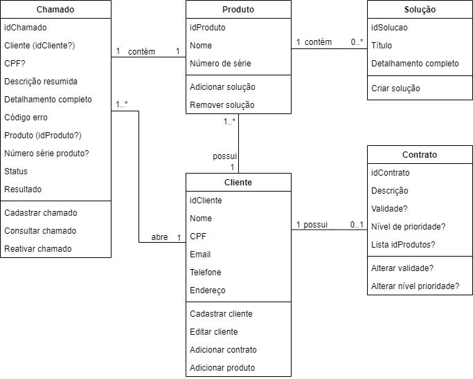

# Instituto InfNet - Tecnologia Java - 2021/1

#### Prova professor Veloso 
#### Grupo: Daniel, Paulo, William

## Ferramenta de Call Center

O objetivo da ferramenta é melhorar a qualidade de atendimento de sua equipe de suporte, garantindo uma consistência no fluxo de atendimento, e considerando aspectos gerenciais e de contrato de suporte, como prioridade de atendimento.

O sistema Call Center permite ao usuário cadastrar chamados, acompanhá-los, consultar soluções anteriores já inseridas na base ou mesmo cadastrar novas soluções. Também permitirá que seus clientes acessem sua base de chamados podendo saber o status em que eles se encontram.

###### Texto original do problema está [no Moodle](https://sae.infnet.edu.br/moodle/mod/forum/view.php?id=333858).

## Requisitos

- Linguagem Java gerenciando as dependências com Maven

- Arquitetura:  micro serviço em API REST ou ~~aplicação em console~~

- Padrão MVC ~~ou abordagem DDD~~

- Postar em um repositório GitHub e informar os nomes dos integrantes do grupo e a [URL deste repositório](https://github.com/pgurjao/callcentermanager-dpw.git) no [fórum do Moodle](https://sae.infnet.edu.br/moodle/mod/forum/view.php?id=333858).

- **Prazo de entrega: 12/04/2021, segunda-feira**

## Análise do problema

### Usuário (funcionário do call center) deve poder:

1. Abrir `chamado`
2. Reativar `chamado`
3. Consultar `chamado`
4. Cadastrar `soluções` vinculadas aos produtos
5. Consultar `soluções` vinculadas aos produtos

### Cliente deve poder:

1. Consultar o status do seu(s) `chamado(s)` no sistema a qualquer momento.

### Abrir Chamado

- Solicitar número de série do produto, ou,
- CPF do cliente para consulta do número de série
- Descrição resumida do problema
- Código de erro (se houver)
- Detalhamento do problema

### Status do Chamado

| Status | Resultado do atendimento |
| ----------- | :----: |
| Cadastrado |  - |
| Em atendimento |  - |
| Finalizado | Cancelado*   Consertado*   Sem solução |

###### *Os resultados *"cancelado"* e *"consertado"* permitem que o chamado seja reativado por meio da alteração de seu status. Já o resultado *"sem solução"* não permite que o chamado seja reativado e seu status deve permanecer *"finalizado"*.

## Diagrama de Classes

## 

### TO DO

- [ ] Permissionamento no Github para Daniel e Paulo fazerem commits no repositório
- [ ] Fazer método `Cliente` (Paulo)
- [ ] Fazer método `Produto` (Daniel)
- [ ] Fazer método `Contrato` (William)
- [ ] Fazer método `Chamado` (todos)
- [x] ~~Escolher se a~~ implementação será micro serviço ~~ou aplicação em console~~
- [x] Escolher MVC ~~ou DDD~~
- [x] Diagrama de classes, etc...
- [x] Debater melhor abordagem e iniciar o código
